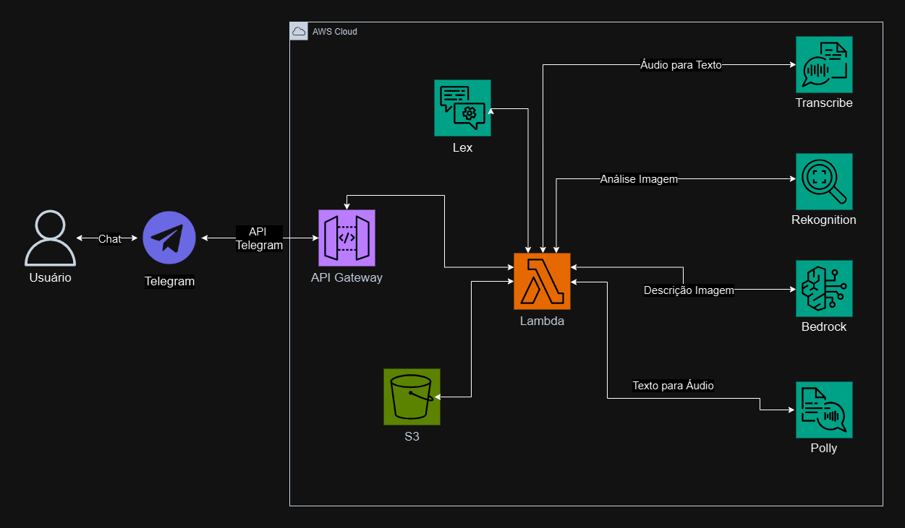

<h1 align="center">Bot para auxiliar pessoas com deficiência visual </h1>
<h2 align="center"> <i>Aurion</i></h2>

<h4 align="center"> <i>Avaliação final do programa de bolsas Compass UOL para formação em machine learning para AWS.</i></h4>

## 🌐 Sobre o Projeto

 
Este bot será desenvolvido com o objetivo oferecer uma ferramenta inclusiva para pessoas cegas, inspirada no movimento <a href="https://mwpt.com.br/criadora-do-projeto-pracegover-incentiva-descricao-de-imagens-na-web/">#ParaCegoVer</a>, que incentiva a descrição de imagens na web. A iniciativa, criada por uma defensora da acessibilidade visual, tem como propósito tornar o conteúdo digital mais acessível para pessoas com deficiência visual, promovendo a inclusão e a equidade. Integrado ao Telegram, o bot permitirá que os usuários enviem imagens para receber descrições detalhadas em áudio ou texto.

O bot estará disponível publicamente no Telegram, onde os usuários poderão interagir de maneira simples e eficiente. Dessa forma, este bot ofecerá uma solução inclusiva e tecnológica para que pessoas cegas possam compreender o conteúdo de imagens de forma acessível. A combinação dos serviços AWS permitirá uma interação fluida e eficaz, com descrições em áudio de alta qualidade e uma experiência de usuário otimizada.

## 🏗️ Arquitetura Preliminar do Projeto

## 🚀 Como utilizar
No telegram, busque por ``Aurion, Seu assistente visual`` e inicie a conversa.

## 📂 Estrutura das Pastas

## 💻 Tecnologias
- AWS Bedrock
- AWS Rekognition
- AWS Transcribe
- AWS S3
- AWS Lex
- AWS Textract
- API Gateway
- Telegram
- Python

## ❌ Dificuldades
Tivemos dificuldades principalmente em analisar imagens com o AWS Rekognition, devido à labels inconsistentes que geravam resultados incorretos no AWS Bedrock.

## 👨‍💻 Autores

  <table style="margin: 0 auto;">
    <tr>
      <td><a href="https://github.com/GabrielAvelarbr"> Gabriel Avelar</a></td>
      <td><a href="https://github.com/JoseJaan"> José Neto</a></td>
      <td><a href="https://github.com/Layonj300"> Layon Reis</a></td>
      <td><a href="https://github.com/LuizFillipe1"> Luiz Fillipe</a></td>
      <td><a href="https://github.com/PamelaPavan"> Pamela Pavan</a></td>
    </tr>
  </table>

