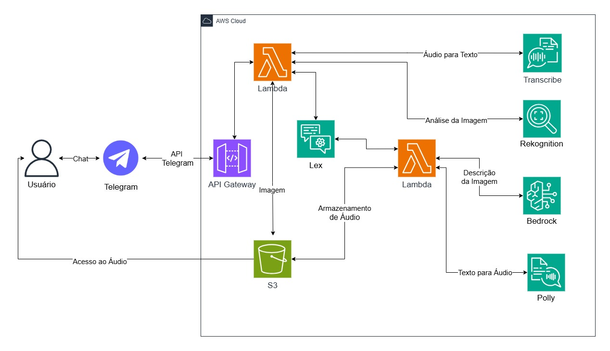

<h1 align="center">Chatbot com Utilização de Ferramentas da AWS</h1>
<h2 align="center"> <i>#ParaCegoVer - Descrição de Imagens para Cegos no Telegram</i></h2>

Avaliação final do programa de bolsas Compass UOL para formação em machine learning para AWS.

---

## 🌐 Sobre o Projeto

 
Este bot será desenvolvido com o objetivo oferecer uma ferramenta inclusiva para pessoas cegas, inspirada no movimento <a href="https://mwpt.com.br/criadora-do-projeto-pracegover-incentiva-descricao-de-imagens-na-web/">#ParaCegoVer</a>, que incentiva a descrição de imagens na web. A iniciativa, criada por uma defensora da acessibilidade visual, tem como propósito tornar o conteúdo digital mais acessível para pessoas com deficiência visual, promovendo a inclusão e a equidade. Integrado ao Telegram, o bot permitirá que os usuários enviem imagens para receber descrições detalhadas em áudio ou texto.

O bot estará disponível publicamente no Telegram, onde os usuários poderão interagir de maneira simples e eficiente. Dessa forma, este bot ofecerá uma solução inclusiva e tecnológica para que pessoas cegas possam compreender o conteúdo de imagens de forma acessível. A combinação dos serviços AWS permitirá uma interação fluida e eficaz, com descrições em áudio de alta qualidade e uma experiência de usuário otimizada.

## 🏗️ Arquitetura Preliminar do Projeto

## 👨‍💻 Autores
- [Gabriel Avelar](https://github.com/GabrielAvelarbr)
- [José Neto](https://github.com/JoseJaan)
- [Layon Reis](https://github.com/Layonj300)
- [Luiz Fillipe Morais](https://github.com/LuizFillipe1)
- [Pamela Pavan](https://github.com/PamelaPavan)

