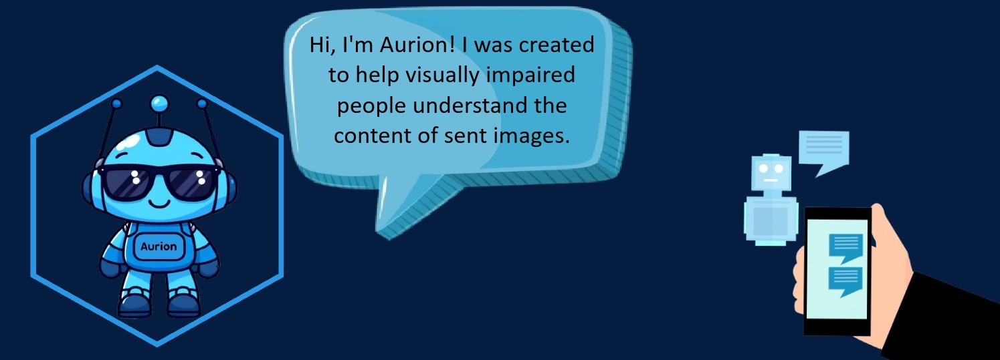

# Aurion: A Visual Assistant Bot for the Visually Impaired 🚀

<i>A bot designed to provide an inclusive tool for the visually impaired by describing images.</i>

## 🌐 About the Project
This bot was developed to offer an inclusive tool for the blind and visually impaired, inspired by the **#ParaCegoVer** movement, which advocates for image descriptions on the web. The initiative aims to make digital content more accessible, promoting inclusion and equality.

Integrated with Telegram, the bot allows users to send images and receive detailed descriptions in either audio or text. It provides a seamless and efficient solution for the visually impaired to understand image content, combining various AWS services for a fluid, high-quality user experience.

## 🏗️ Project Architecture

## 💻 Technologies Used
- AWS Bedrock
- AWS Rekognition
- AWS Transcribe
- AWS S3
- AWS Lex
- AWS Textract
- API Gateway
- Telegram
- Python

## 🚧 Challenges Faced
Developing this bot presented some significant challenges, primarily related to image analysis and data consistency:

* **Inconsistent Image Analysis:** We faced significant challenges when working with image analysis using **AWS Rekognition**.
* **Inaccurate Labels:** The main problem was related to the inconsistent and sometimes inaccurate labels provided by the service.
* **Incorrect Results from AWS Bedrock:** These inconsistencies in the labels led to imprecise analyses, which in turn affected data integration with **AWS Bedrock**.

## 👨‍💻 Authors

  <table style="margin: 0 auto;">
    <tr>
      <td><a href="https://github.com/GabrielAvelarbr"> Gabriel Avelar</a></td>
      <td><a href="https://github.com/JoseJaan"> José Neto</a></td>
      <td><a href="https://github.com/Layonj300"> Layon Reis</a></td>
      <td><a href="https://github.com/LuizFillipe1"> Luiz Fillipe</a></td>
      <td><a href="https://github.com/PamelaPavan"> Pamela Pavan</a></td>
    </tr>
  </table>

